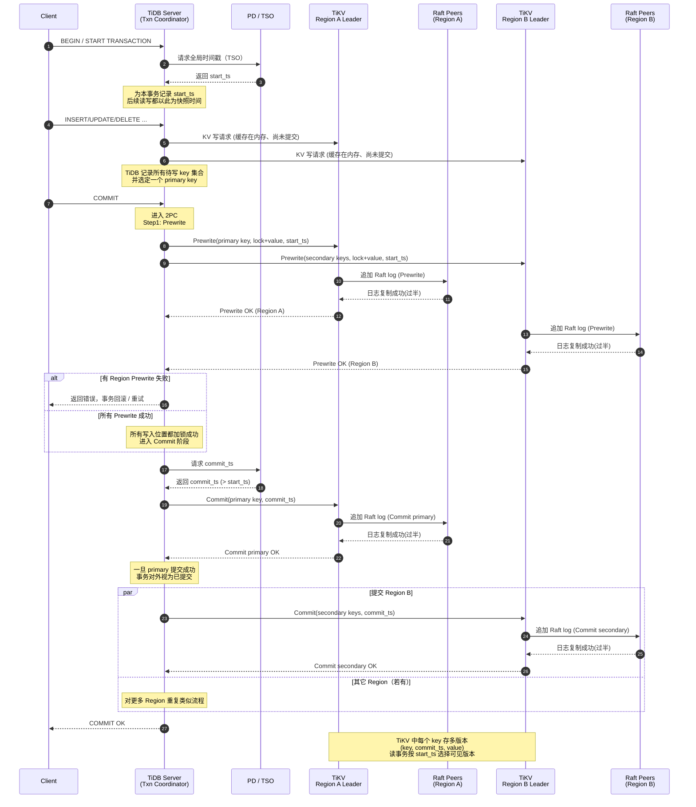

## 一、TiDB 是什么？整体目标 & 架构风格

**一句话：**

> **TiDB 是一套 MySQL 协议兼容的、基于 Raft 的分布式 HTAP 数据库。**
>  它把整个集群拆成：
>
> - **TiDB Server（无状态 SQL 计算层）**
> - **PD（Placement Driver，集群“大脑”）**
> - **TiKV（行存分布式 KV 引擎）**
> - **TiFlash（列存分析引擎，可选，用于 HTAP）**[pingcap.github.io+2TiDB+2](https://pingcap.github.io/tidb-dev-guide/understand-tidb/introduction.html?utm_source=chatgpt.com)

整体是典型的 **Share-Nothing 架构**：每个节点都是独立进程，通过网络 + Raft + TSO 协调。

一个 TiDB 集群可以粗暴画成这样：

```
        ┌──────────────────────┐
        │      TiDB Server     │   ← SQL / MySQL 协议、解析、优化、执行
        │ (stateless, 多实例) │
        └─────────▲────────────┘
                  │
    ┌─────────────┼────────────────┐
    │             │                │
┌───┴───┐   ┌─────┴────┐    ┌──────┴─────┐
│  PD   │   │   TiKV   │    │  TiFlash   │
│集群   │   │ 行存引擎 │    │ 列存引擎   │
└───▲───┘   └────▲─────┘    └────▲───────┘
    │            │               │
    └────────────┴───────────────┘
           Raft + Region + TSO
```

------

## 二、三大核心组件 + TiFlash：各干什么？

### 1. TiDB Server：**SQL / 计算层（无状态）**

- 对外看起来就是一个 **MySQL Server**：
  - 兼容 MySQL 协议、绝大部分语法、JDBC/驱动等。
- 但本身 **不存数据，只负责“算”**：[pingcap.github.io+1](https://pingcap.github.io/tidb-dev-guide/understand-tidb/introduction.html?utm_source=chatgpt.com)
  - SQL 解析、优化器（CBO）、执行计划生成；
  - 把逻辑算子拆成对底层 KV 的一系列 **key-range 读写**；
  - 把并行任务分发到多个 TiKV / TiFlash 节点。

> 你可以把 TiDB Server 理解成：
>  **“带 MySQL 协议的分布式 SQL 引擎 + 分布式事务协调器”。**

------

### 2. PD（Placement Driver）：**集群大脑 / 调度中心**

PD 的角色非常关键，可以理解为 TiDB 的 **“etcd + 元数据 + 调度 + 全局时钟 TSO”**：

- **管理集群元数据**：
  - TiKV / TiFlash 节点列表、拓扑结构；
  - 所有 Region 的分布、Leader 位置、Replica 情况。[docs.pingcap.com+2TiDB+2](https://docs.pingcap.com/tidb/stable/tidb-architecture/?utm_source=chatgpt.com)
- **全局 TSO（Timestamp Oracle）**：
  - 给每个事务分配全局递增的时间戳（start_ts、commit_ts）；
  - 这是 TiDB MVCC 的时间轴基础。
- **调度 & 负载均衡**：[docs.pingcap.com+3TiDB+3tikv.org+3](https://www.pingcap.com/article/understanding-tidbs-cluster-architecture-and-core-components/?utm_source=chatgpt.com)
  - 根据 Region 的读写压力和副本分布，自动做：
    - Region split / merge；
    - Region Leader / 副本迁移；
    - 跨机房、跨机架的副本放置（Placement Rules）。
- **高可用**：
  - 一般部署 **奇数个 PD**，基于 **Raft / etcd** 选主。

------

### 3. TiKV：**行存分布式 KV & 多 Raft 存储层**

TiKV 是 **分布式、事务型 KV 引擎**，对 TiDB 来说相当于 “分布式的 InnoDB + RocksDB 组合”：[docs.pingcap.com+3docs.pingcap.com+3tikv.org+3](https://docs.pingcap.com/tidb/stable/tikv-overview?utm_source=chatgpt.com)

#### 3.1 基本概念：Node / Store / Region

- **Node**：一台物理机/虚机/容器；
- **Store**：一般 Node 上跑一个 TiKV 实例，对应一个 Store；[tikv.org+1](https://tikv.org/docs/3.0/concepts/architecture/?utm_source=chatgpt.com)
- **Region**：
  - TiKV 里 **数据按 key 范围切成很多 Region**（默认大小几十 MB 量级，如 96MB 左右）；
  - 每个 Region 保存某个 `[StartKey, EndKey)` 范围的数据。[docs.pingcap.com+2dbdb.io+2](https://docs.pingcap.com/tidb/stable/tidb-storage?utm_source=chatgpt.com)
- **Region 副本 & multi-Raft**：
  - 每个 Region 通常有 3 个副本（可配置）；
  - 副本分布在不同 Store / Node 上；
  - 这几个副本构成一个 **Raft Group**，以 Region 为单位跑共识；[InfoQ+4TiDB+4TiDB+4](https://www.pingcap.com/blog/tidb-internal-data-storage/?utm_source=chatgpt.com)
  - 某个副本是 Leader，负责该 Region 的读写，其它是 Follower / Learner。

> 所以底层是一个巨大的 **multi-Raft 集群**，每个 Region 一条 Raft 日志。

#### 3.2 TiKV 内部存储：RocksDB + Raft Log

- 在每个 Store 里，底层通常是：[VLDB+3tikv.org+3tikv.org+3](https://tikv.org/docs/3.0/concepts/architecture/?utm_source=chatgpt.com)
  - **RocksDB** 存真正的用户数据（MVCC Key-Value）；
  - 早期把 Raft 日志也放 RocksDB，后来引入 **Raft Engine** 做专用日志存储。
- 写入流程（简化版）：
  1. TiDB 把某行写拆成多个 KV（Row / Index）；
  2. 定位到相应的 Region Leader；
  3. 写入该 Region 的 **Raft 日志**；
  4. 日志在多个副本间复制，**过半提交** 后应用到 RocksDB。[TiDB+3docs.pingcap.com+3tikv.org+3](https://docs.pingcap.com/tidb/stable/tidb-best-practices/?utm_source=chatgpt.com)

------

### 4. TiFlash：**列存 + MPP 的 HTAP 分析引擎**

TiFlash 是 TiDB 4.0 开始引入的 **列存扩展**，是实现 HTAP 的关键组件：[TiDB+5docs.pingcap.com+5TiDB+5](https://docs.pingcap.com/tidb/stable/tiflash-overview?utm_source=chatgpt.com)

- **列式存储**：
  - 将 TiKV 中的行式数据按列形式存储；
  - 适合 Scan 大量列、聚合/分析型 SQL（OLAP）。
- **Raft Learner 副本**：
  - 对于选中的表/分区，TiFlash 挂接为对应 Region 的 Learner 副本；
  - 实时从 TiKV 同步 Raft Log，保证和 TiKV **数据强一致**（非 ETL 式异步）。[VLDB+2ResearchGate+2](https://www.vldb.org/pvldb/vol13/p3072-huang.pdf?utm_source=chatgpt.com)
- **MPP 执行器**：
  - TiFlash 自带 MPP 引擎，可以多节点分布式执行 Hash Join / 聚合等；
  - TiDB 优化器可以决定把某些算子下推到 TiFlash 以加速。

> 总体上：
>  **TiKV = 行存、OLTP；TiFlash = 列存、OLAP**，两者共享同一份事务数据视图，形成真正 HTAP。[TiDB+2docs.pingcap.com+2](https://www.pingcap.com/article/exploring-tidbs-distributed-architecture-and-htap-model/?utm_source=chatgpt.com)

------

## 三、数据如何切分 & 存放：Region 视角

### 1. 逻辑表 → KV → Region

TiDB 把一张表映射到 TiKV 的 KV 空间中（简化理解）：

- 表中的一行，会被编码为多条 KV：
  - 1 条 Row 记录（主键 / rowID 作为 key）；
  - 多条二级索引记录（secondary index key → handle）。[docs.pingcap.com+2VLDB+2](https://docs.pingcap.com/tidb/stable/tidb-storage?utm_source=chatgpt.com)
- 整个 KV 空间按 key 范围划分为多个 Region；
- 每个 Region 负责一个连续 key 范围，可以跨多表/多索引。

### 2. Region Split / Merge & Rebalance

- 当某个 Region 太大或热点明显时，TiKV 会请求 PD 对其 **split**：
  - 原来的 `[StartKey, EndKey)` 被切成两个或多个 Region；
  - 方便并行、减轻单 Region 压力。[TiDB+1](https://www.pingcap.com/blog/tidb-internal-scheduling/?utm_source=chatgpt.com)
- 当 Region 太小、太多时，可以 **merge** 减少管理开销。
- PD 会根据统计信息和拓扑做 **调度**：
  - 把一些 Region 的 Leader / 副本迁移到较空闲的 Store；
  - 用 Placement Rules 控制 Region 在不同机房、机架上分布。[TiDB+3TiDB+3tikv.org+3](https://www.pingcap.com/article/understanding-tidbs-cluster-architecture-and-core-components/?utm_source=chatgpt.com)

> 这样整个集群在**数据量 & QPS 增长**时，可以通过加 TiKV/TiFlash 节点 + PD 的自动调度实现真正的水平扩展。

------

## 四、事务与一致性：TSO + MVCC + 2PC + Raft

TiDB 的事务模型大致沿袭 Google Percolator 思路，并结合 multi-Raft 做优化。[docs.pingcap.com+2VLDB+2](https://docs.pingcap.com/tidb/stable/tidb-best-practices/?utm_source=chatgpt.com)

### 1. 全局时间戳 TSO

- 每个事务开始时，TiDB 向 PD 请求一个 **全局递增的 timestamp**：
  - 作为 `start_ts`，用来确定快照读的视图；
  - 提交时再拿一个 `commit_ts`。[docs.pingcap.com+2TiDB+2](https://docs.pingcap.com/tidb/stable/tidb-architecture/?utm_source=chatgpt.com)

### 2. MVCC 存储

- TiKV 中每个 key 实际存多个版本：（key, commit_ts）；
- 读事务按自己的 `start_ts` 找到**小于等于它的最新版本**；
- 写事务通过**锁记录** + `start_ts/commit_ts` 实现隔离。[docs.pingcap.com+2VLDB+2](https://docs.pingcap.com/tidb/stable/tidb-storage?utm_source=chatgpt.com)

### 3. 两阶段提交（2PC）

简化写入过程（事务提交阶段）：

1. **Prewrite 阶段**：
   - TiDB 选一个主键作为 primary key；
   - 对所有涉及的 key，向对应 Region Leader 发 prewrite 请求：
     - 检查冲突；
     - 写入锁和数据（未提交）。
2. **Commit 阶段**：
   - 向 PD 申请 `commit_ts`；
   - 先提交 primary key：写入 commit 记录；
   - 再异步提交其他 secondary key。[ResearchGate+2docs.pingcap.com+2](https://www.researchgate.net/publication/344973055_TiDB_a_Raft-based_HTAP_database?utm_source=chatgpt.com)
3. **底层依赖 Raft**：
   - 每个 Region 内部通过 Raft 保证多副本一致；
   - TiDB 在 Raft 之上做跨 Region 的事务协调。

### 4. 读写一致性保证

- **强一致**：
  - 写：必须写入多数副本（比如 3 副本中的 2 个）才返回成功；[docs.pingcap.com](https://docs.pingcap.com/tidb/stable/tidb-best-practices/?utm_source=chatgpt.com)
  - 读：默认从 Leader 读；或者通过 follower read（需满足一致性条件）。
- **Snapshot Read**：
  - 大部分 SELECT 都是快照读，按 `start_ts` 从 MVCC 找到一致视图。

------

## 五、查询执行路径：从客户端到存储节点

### 1. OLTP 查询（走 TiKV）

以一个普通 `SELECT * FROM t WHERE id = ?` 为例：

1. 客户端通过 MySQL 协议连接某个 TiDB Server；
2. TiDB 解析 SQL、做优化，得到执行计划（index lookup / table scan 等）；
3. 根据表 / 索引的 key 编码，算出要访问的 **key range**；
4. 向 PD 查询这些 key range 分布在哪些 Region / Leader；[docs.pingcap.com+2pingcap.github.io+2](https://docs.pingcap.com/tidb/stable/tidb-architecture/?utm_source=chatgpt.com)
5. 和对应 TiKV Leader 建连接，发出批量 KV 请求（coprocessor）；
6. TiKV 在本地 RocksDB 中按 MVCC 找数据，将结果返回；
7. TiDB 进行算子级处理（join、聚合等），输出给客户端。

### 2. OLAP / HTAP 查询（走 TiFlash）

当你执行大范围聚合 / 分析 SQL 时：

1. 优化器判断使用 TiFlash 更合适（列少 / 扫描量大 / 代价模型判断）；[TiDB+2docs.pingcap.com+2](https://www.pingcap.com/article/exploring-tidbs-distributed-architecture-and-htap-model/?utm_source=chatgpt.com)
2. 生成包含 TiFlash Scan / MPP Shuffle 的执行计划；
3. 将部分算子下推到 TiFlash MPP 集群执行；
4. 多个 TiFlash 节点间做并行 Hash Join / 聚合；
5. 最终结果返回 TiDB，再返回客户端。

------

## 六、扩展性 & 高可用：怎么“加机器、扛故障”？

- **水平扩展：**
  - 增加 TiDB Server：提升并发 SQL 处理能力；
  - 增加 TiKV：存更多数据、承载更多读写；
  - 增加 TiFlash：提升分析能力。[docs.pingcap.com+2docs.pingcap.com+2](https://docs.pingcap.com/tidb/stable/tikv-overview?utm_source=chatgpt.com)
- **自动负载均衡：**
  - PD 根据各 Store / Region 的统计信息进行调度；
  - 自动把热点 Region 拆分、迁移；[TiDB+3TiDB+3tikv.org+3](https://www.pingcap.com/article/understanding-tidbs-cluster-architecture-and-core-components/?utm_source=chatgpt.com)
- **高可用：**
  - 每个 Region 多副本，少数节点宕机不影响整体读写；[docs.pingcap.com+2docs.pingcap.com+2](https://docs.pingcap.com/tidb/stable/tidb-best-practices/?utm_source=chatgpt.com)
  - TiDB / TiKV / TiFlash 都可以在节点层面做冗余部署，前面挂负载均衡器或 DNS。

------

## 七、和传统 MySQL 架构的核心区别（帮你快速对齐思维）

- **MySQL(InnoDB)**：
  - 单机为主（加主从 / 分库分表方案）；
  - InnoDB 做本地事务 & 存储；
  - 分布式、扩展、高可用靠中间件或外部组件。
- **TiDB**：
  - **从设计之初就是分布式 + 多副本 + Raft + TSO**；[VLDB+2ResearchGate+2](https://www.vldb.org/pvldb/vol13/p3072-huang.pdf?utm_source=chatgpt.com)
  - SQL、事务、分布式、存储、调度是一个体系内的方案；
  - 从客户端视角 **“一个大 MySQL 实例 + 自动分片 + 自动扩容 + HTAP”**。


## 八、TiDB 事务写入流程（2PC + Raft + TSO）” 时序图

### 1. 参与角色说明

在图里我用这些“泳道”：

- `Client`：应用程序 / MySQL 客户端
- `TiDB`：接收 SQL、做事务协调的 TiDB Server
- `PD/TSO`：PD 集群中的 TSO 服务（分配全局时间戳）
- `TiKV Region A/B`：两个被本次事务涉及的 Region 的 **Leader 节点**（只画 Leader，实际还有其他副本）
- `Raft Peers A/B`：Region A/B 对应的其他副本节点（Follower / Learner）

------

### 2. Mermaid 时序图代码



### 3. 用一句话串起来整个流程

从时序角度看，一次 TiDB 事务写入的大致节奏是：

1. **开始事务**：TiDB 向 PD/TSO 申请 `start_ts`，确定快照时间。
2. **读写阶段**：TiDB 把 SQL 翻译成对多个 Region 的 KV 操作，先缓存在 TiKV（未 commit）。
3. **Prewrite 阶段**：TiDB 作为协调者，对所有涉及的 key（primary + secondary）发 Prewrite：
   - 每个 Region Leader 把 Prewrite 写入本 Region 的 Raft Log；
   - 日志过半复制成功 → 在本地写入“锁 + 值”。
4. **所有 Prewrite 成功后**：TiDB 向 PD/TSO 再要一个更大的 `commit_ts`。
5. **提交 primary key**：
   - TiDB 同步提交 primary key（Raft 再走一轮）；
   - primary key 成功后，对外认为事务已经提交成功。
6. **提交 secondary keys**：可以异步提交，其它 Region 逐个写入 Commit 记录。
7. **之后所有读事务**：根据自己的 `start_ts`，在 TiKV 的 MVCC 版本中选出小于等于它且最新的版本。